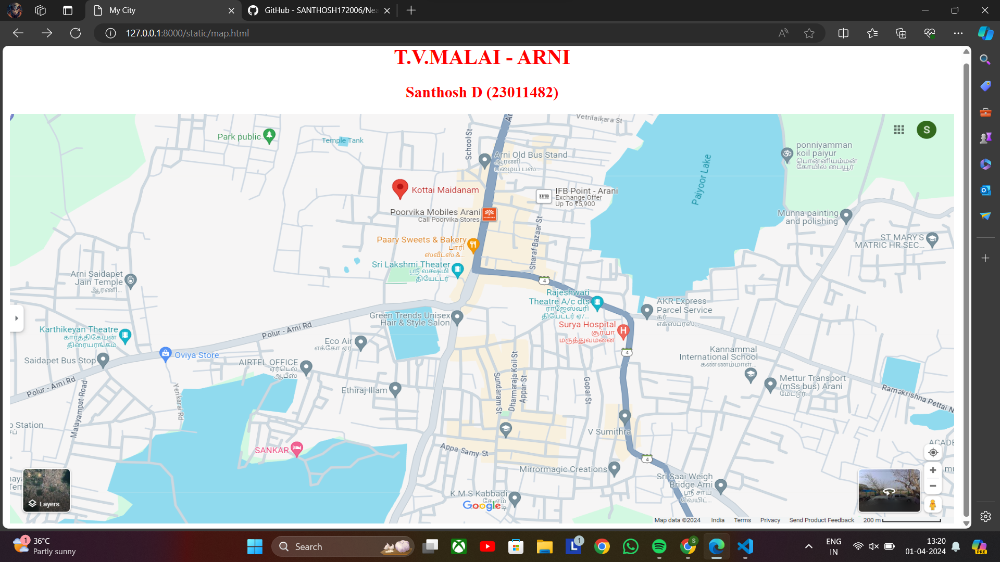
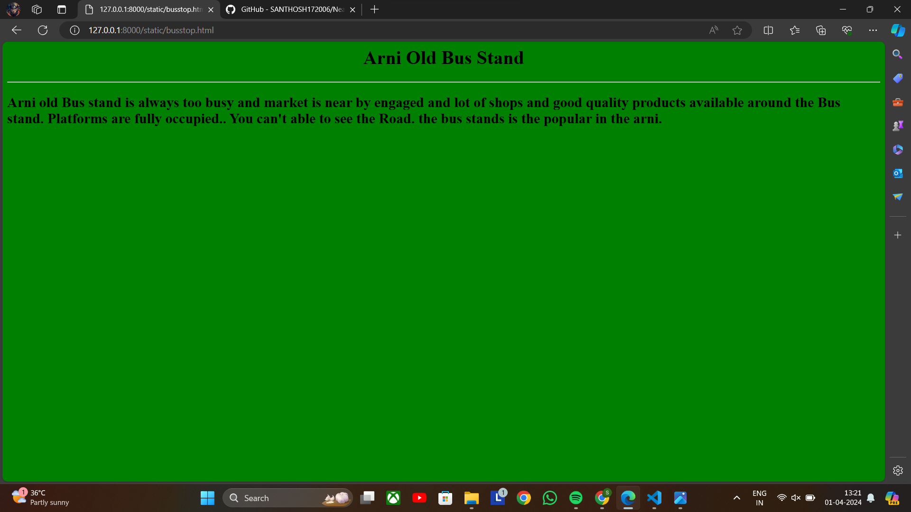
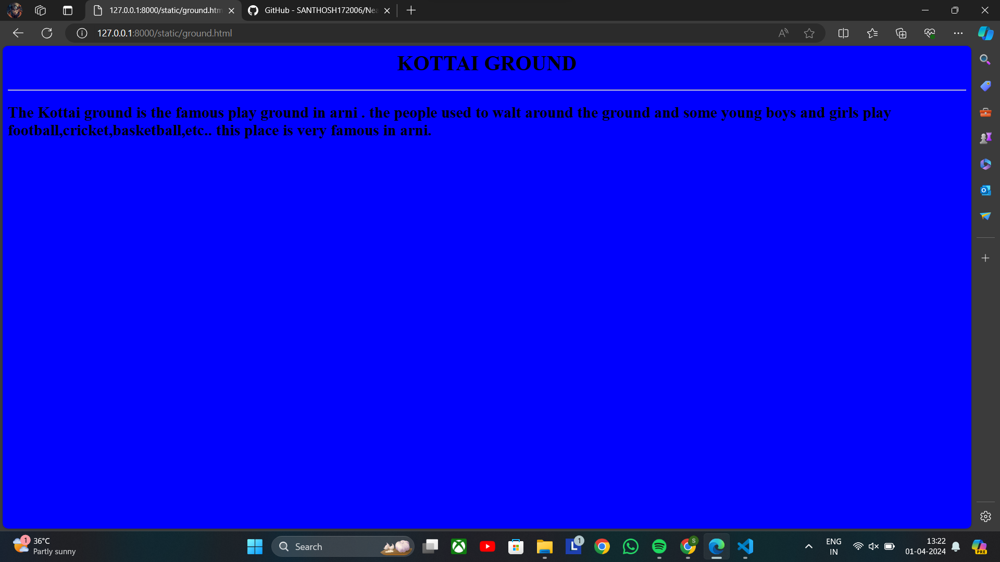
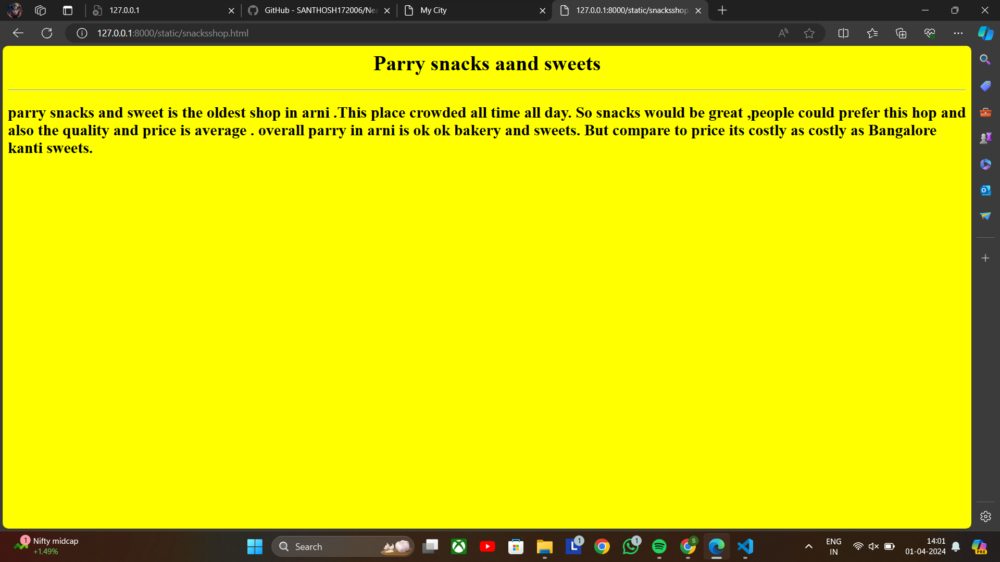
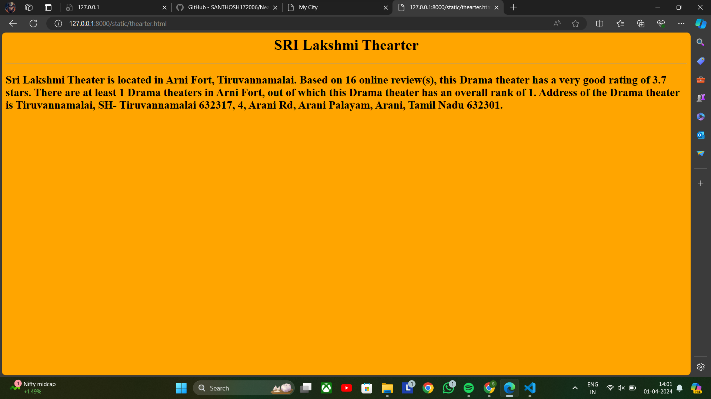
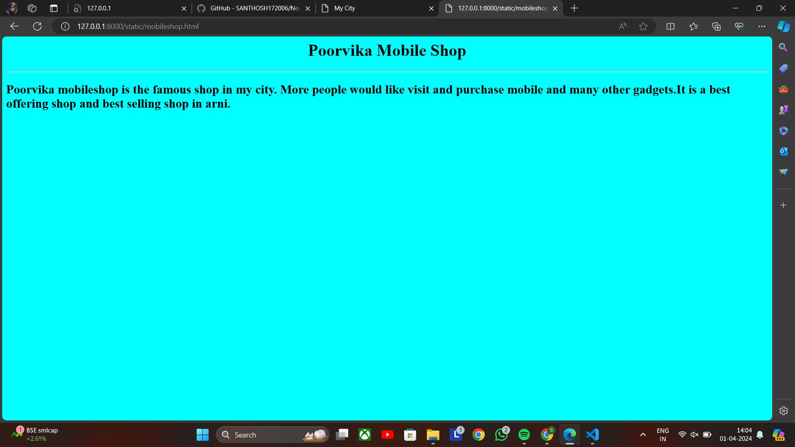

# Ex04 Places Around Me
## Date: 20.03.2024

## AIM
To develop a website to display details about the places around my house.

## DESIGN STEPS

### STEP 1
Create a Django admin interface.

### STEP 2
Download your city map from Google.

### STEP 3
Using ```<map>``` tag name the map.

### STEP 4
Create clickable regions in the image using ```<area>``` tag.

### STEP 5
Write HTML programs for all the regions identified.

### STEP 6
Execute the programs and publish them.

## CODE
```
map.html 


<html>
<head>
    <title>
        My City
    </title>
</head>
<body>
    <h1 align="center">
        <font color="red"><b> T.V.MALAI - ARNI</b></font>
    </h1>
    <h2 align="center">
        <font color="red"><b>Santhosh D (23011482)</b></font>
    </h2>
    <center>
        
        <map name="Arni">
        <area shape="rect" coords="725,155,755,170" href="mobileshop.html" title="Poorvika Mobiles">
        <area shape="rect" coords="660,240,710,290" href="thearter.html" title="Sri Lakshmi Theater">
        <area shape="rect" coords="580,90,650,130" href="ground.html" title="Kottai Ground">
        <area shape="rect" coords="700,210,750,260" href="snacksshop.html" title="parry snacks">
        <area shape="rect" coords="720,50,770,100" href="busstop.html" title="old bus stand">
    </map>

    </center>
</body>


</html>

busstop.html

<html>
    <head>
        <center>
        <h1>Arni Old Bus Stand</h1>
    </center>
    </head>
    <hr>
    <body bgcolor="green" >
        <h2>Arni old Bus stand is always too busy and market is near by engaged and lot of shops and good quality products available around the Bus stand.

            Platforms are fully occupied..
            You can't able to see the Road.
            
            Fully congested arni</h2>
        </h2>
        </body>
</html>

snacksshop.html


<html>
    <head>
        <center>
        <h1>Parry  snacks aand sweets</h1>
    </center>
    </head>
    <hr>
    <body bgcolor="yellow" >
        <h2>
           parry snacks and sweet is the oldest shop in arni .This place crowded all time all day. So snacks would be great ,people could prefer this hop and also the quality and price is average . overall parry in arni is ok ok bakery and sweets. But compare to price its costly as costly as Bangalore kanti sweets.</h2>
        </h2>
        </body>
</html>

ground.html

<html>
    <head>
        <center>
        <h1>
KOTTAI GROUND
        </h1>
    
    
    
    </center>
    </head>
    <hr>
    <body bgcolor="blue" >
      <h2>The Kottai ground is the famous play ground in arni . the people used to walt around the ground and some young boys and girls play football,cricket,basketball,etc.. this place is very famous in arni.</h2>
        </body>
</html>

theater.html

<html>
    <head>
        <center>
        <h1>
SRI Lakshmi Thearter
        </h1>
    
    
    
    </center>
    </head>
    <hr>
    <body bgcolor="orange" >
      <h2>
        Sri Lakshmi Theater is located in Arni Fort, Tiruvannamalai. Based on 16 online review(s), this Drama theater has a very good rating of 3.7 stars. There are at least 1 Drama theaters in Arni Fort, out of which this Drama theater has an overall rank of 1. Address of the Drama theater is Tiruvannamalai, SH- Tiruvannamalai 632317, 4, Arani Rd, Arani Palayam, Arani, Tamil Nadu 632301.</h2>
        </body>
</html>

mobileshop.html

<html>
    <head>
        <center>
        <h1>Poorvika Mobile Shop</h1>
    </center>
    </head>
    <hr>
    <body bgcolor="cyan" >
        <h2>Poorvika mobileshop is the famous shop in my city. More people would like visit and purchase mobile and many other gadgets.It is a best offering shop and best selling shop in  
        </h2>
        </body>
</html>
```

## OUTPUT












## RESULT
The program for implementing image maps using HTML is executed successfully.
